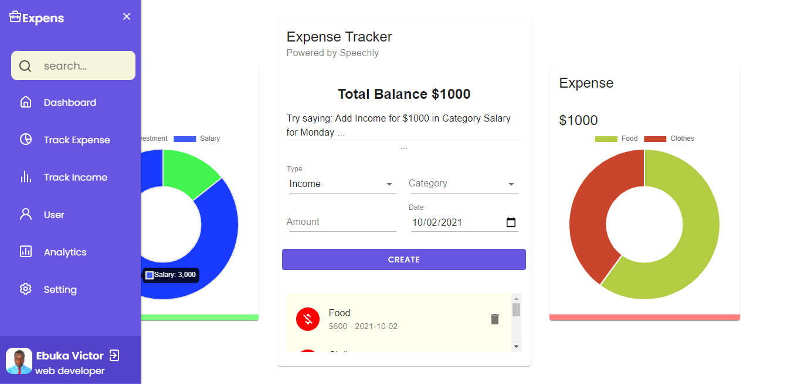
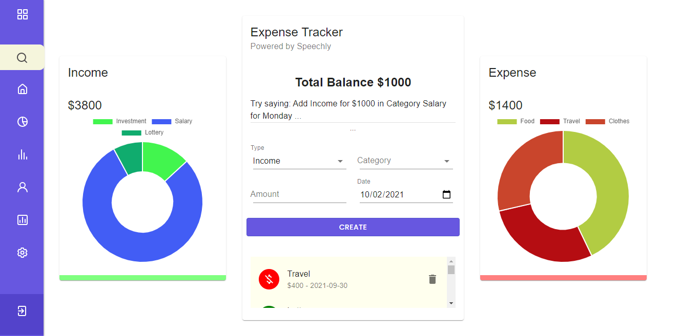

# Expens

## _A voice automated web app which helps to track and analyze income and expenses of user_

- Powered by
- 
  > the best practices for handling speech input in a Speechly React app.

Expens is a voice-automated app, for finacial assistance and managing of income, and expenses,
ReactJS-powered App.

-
- ✨Welcome✨

## Features

- Voice automated expense history search
- filtering and sorting transactions
- financial assistance.
- Graphic representation of data including charts
-

This project helped me in so many ways, i had a good understanding of using a
voice interface API, and insight on other technologies

> It uses Context Api to provide data across the entire app
> Along with useReducer hook to manage state.
> Created custome hook as best fit to create reusable logic for filtering of data for the chartjs component
> as possible. The ultimate goal is to:
> make it easy for user to View the optimal layout for the site depending on their device's screen size.
> make the app user-friendly.
> help user manage and track their expenses/income.

### Screenshot

;
;

## Tech

Expens uses a number of open source projects to work properly:

### Built with

- CSS custom properties
- Flexbox
- CSS Grid
- Mobile-first workflow
- React Hooks
- Context API
- [React](https://reactjs.org/) - JS library
- [Material UI](https://mui.com/) - React UI library
- [Chart JS](https://chartjs.com/) - For graphic representation of data

## Installation

This project requires [Node.js](https://nodejs.org/) v10+ to run.

- clone the repo or download the zip file
  Install the dependencies and devDependencies and start the server.

```sh
cd expens
npm install
npm start
```

For production environments...

```sh
npm install --production
npm start
```

## Continued development

As further implementation, i will like to add a user authentication and authenticate users, and store all user related data to a database, instead of using local storage to store data.

> Author: `--EBUKA Victor`.

## License

MIT

```

```
